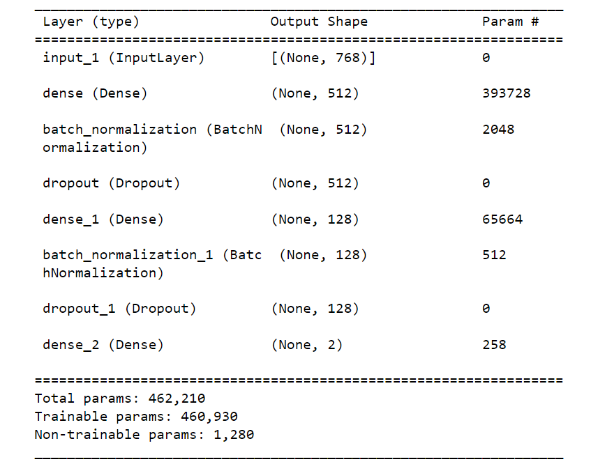

Test Challenge

Task: Spam detection

## Approach

In order to achieve the goal, the following approach has been taken:
1. We use a pretrained BERT model to get embeddings from the dataset, as the pretrained model already encodes the input text information in the form of embedding vectors.
2. We train a dense network using the generated embeddings as inputs, as a small dense network is capable of learning patterns from the embeddings of the pretrained model.
3. With the CLI, the user can write the input directly into the terminal and receive a label indicating whether it’s spam or not.
   
## Train data
* ***Data filtering***

The data was acquired from Kaggle's reputable repository [here](https://www.kaggle.com/datasets/uciml/sms-spam-collection-dataset), wherein redundant columns were eliminated during preprocessing. The columns were adroitly relabeled as "ham_spam" and "text". Subsequently, a partitioning into distinct training and testing subsets was performed. All the preprocessing steps are done in [Data_preprocessing.ipynb](./Data_preprocessing) notebook.

During the analysis, it was identified that the SMS data contained unknown symbols, likely due to encoding problems. To address this challenge, a new dataset was generated using ChatGPT, an advanced language model. This approach allowed for the creation of a clean dataset free from any encoding issues, enabling more accurate analysis and model training.The steps for generating a clean dataset using ChatGPT are documented in the [Data_generation.ipynb](./Data_generation.ipynb)  notebook.

* ***Text embedding***

Following the preliminary data processing, the renowned Bert model from HuggingFace ([model documentation](https://huggingface.co/transformers/v4.8.2/model_doc/bert.html)) was deployed to generate text embeddings. The target column was encoded, representing "ham" as 0 and "spam" as 1. 

## Classification model
The classification model we used is a fully connected neural network. It consists of multiple dense layers, batch normalization, and dropout layers to prevent overfitting. The final layer uses softmax activation, allowing the model to predict the probability of a message being ***"ham"*** or ***"spam"***.
 

  
  
Model architecture with parameters

Training pipeline is presented in [Training.ipynb](./Training.ipynb) notebook.

## Training Performance:

During the training phase, the model demonstrated commendable performance. The evaluation metrics employed to assess its learning capabilities revealed promising results. The model showcased significant progress in comprehending the underlying patterns within the data.

## Inference Performance:

The inference phase also yielded positive outcomes; however, a slight decrease in model precision was observed. This reduction in precision can be attributed to the distribution of the training data. It appears that the model might not have been adequately exposed to certain data patterns during training, leading to suboptimal performance during inference.

## Recommendations:

To enhance the model's performance during inference, we propose the following recommendation:

Data Augmentation: Enlarging the training dataset by applying data augmentation techniques can be an effective strategy to improve the model's ability to generalize to diverse data patterns. By introducing variations in the training data, the model will have a better grasp of the underlying data distribution, ultimately leading to improved inference performance.
Conclusion:

In conclusion, the model exhibited a strong learning capability during training, but there was a minor decline in precision during inference due to the data distribution disparity. By implementing the recommended approach of enlarging the training dataset through data augmentation, we expect the model's performance to be substantially enhanced during inference.

## Usage

To run the inference:

`python inference.py`

## Inference test examples

1. Your account balance is running low. Refill now to continue using our service -> `SPAM`
2. Have you seen the latest news headlines? -> `HAM`
3. Enter our amazing giveaway now for your shot at the ultimate tech prize! -> `SPAM`
4. Let's meet for coffee this afternoon. -> `HAM`
